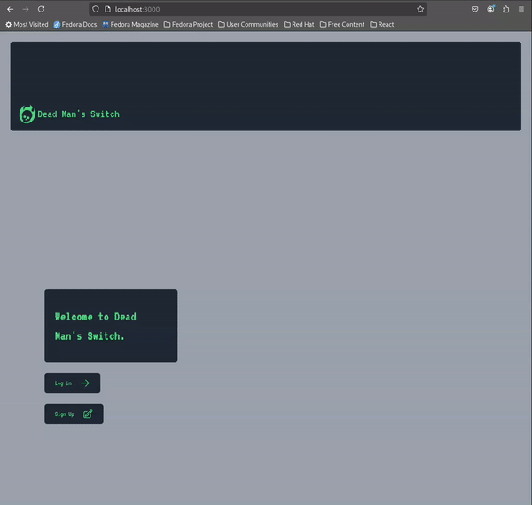

# Dead Man's Switch

## Concept

Have you ever been watching a movie or TV show and the protaganist is in a precarious situation with an adversary and they say something like: "If anything happens to me, all of the evidence I have of your dastardly deeds will be sent to the newspapers, FBI, etc."? Well, that's where the idea for this project came from. What if there was an app where the protaganist could save their evidence and schedule it to be sent unless they update the expiration date? That's where the Dead Man's Switch app comes in!

**Note:** This project is primarily a way for the author (me, bradj121) to try new things with fullstack dev and is not meant to provide any service to be used for nefarious purposes :) Furthermore, this is still a WIP

## What it's Made of

The backend is written in Python/FastAPI, the frontend is written in React/Typescript/Next.js

At this point it's pretty simple and portable and uses a local sqlite3 instance for data storage and local storage to keep 'policy' attachments organized

## How it Works

Try it out by cloning this repo and running:

```
pnpm dev
```

Of course you will need to have `pnpm` locally as well as `Python 3.12` and `uv` installed. See the dependencies section.

Once the frontend and backend are running, navigate your browser to `localhost:3000`, create a user and login.

Then you can create a 'Policy' (think of it like an insurance policy should something happen to you), where you specify who to send the evidence to. The evidence will be sent as an email and you can specify a subject, body and attach any files. 

Then you can specify when the policy should expire. On this date, the server will generate an email with the policy fields (subject, body, attachments) and send it to the specified recipients.

Here is a demo:



## Dependencies
* [pnpm](https://pnpm.io/installation)
* [uv](https://docs.astral.sh/uv/getting-started/installation/)
* Python 3.12
* If you want to actually send emails using this app, you will need to supply some environment variables: 
    * `SMTP_HOST`: The url of the SMTP server you want to use
    * `SMTP_PORT`: The port to use for the SMTP server
    * `SENDER_EMAIL`: The email/username that can be used to authenticate with the SMTP server
    * `SENDER_PW`: The password used to authenticate the above user with the SMTP server